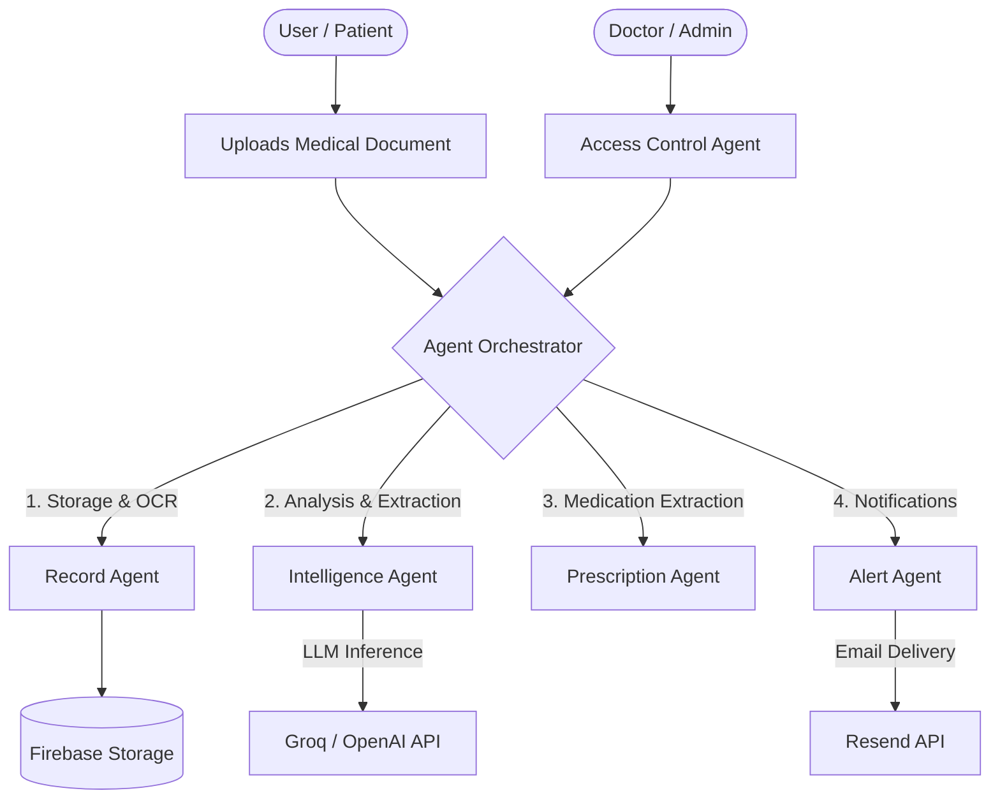

# MedVault

> A secure, intelligent healthcare management platform powered by Multi-Agent AI Orchestration.

🌐 **[Live Demo](https://medvault-teal.vercel.app/)**

MedVault is a comprehensive healthcare application designed to bridge the gap between patients and medical professionals. It streamlines medical data management by providing role-based access, intelligent document processing, and automated real-time alerts.

## 🤖 AI Orchestration Workflow

MedVault leverages a sophisticated multi-agent system to handle complex workflows autonomously. The orchestrator acts as the central brain, delegating tasks to specialized agents (Intelligence, Record, Alert, etc.).

### Agent Roles:
- **Record Agent**: Manages secure storage and OCR (Optical Character Recognition) parsing of uploads.
- **Intelligence Agent**: Processes parsed text to extract insights, critical diagnoses, and actionable health summaries.
- **Prescription Agent**: Specializes in reading and managing medication workflows.
- **Alert Agent**: Dispatches real-time email alerts and emergency notifications dynamically based on the intelligence agent's findings.
- **Access Agent**: Ensures strict role-based access control (RBAC) separating patients and doctors.

## ✨ Key Features

- **Role-Based Portals**: Dedicated interfaces for both Patients and Doctors.
- **Intelligent Document Processing (OCR)**: Seamlessly extract information from uploaded medical documents and lab results.
- **Real-Time Notifications**: Automated email alerts for critical updates and appointments.
- **Secure Data Storage**: Robust authentication and data storage powered by Firebase.

## 🛠️ Technology Stack

- **Frontend**: React, Vite, Tailwind CSS, Radix UI
- **Backend**: FastAPI, Python
- **Database & Auth**: Firebase
- **Integrations**: Tesseract (OCR), Resend (Email Notifications), OpenAI/Groq API

## 📄 License

This project is licensed under the MIT License - see the [LICENSE](LICENSE) file for details.
Copyright (c) 2026 Danish Jain.
